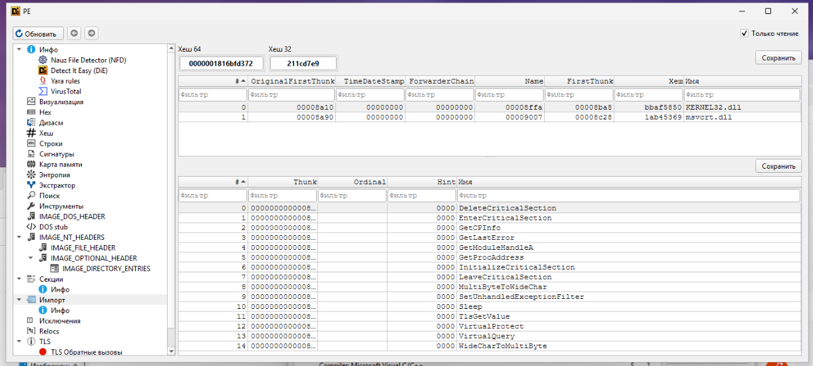

# ApiHashing

A small Windows C++ Proof of Concept demonstrating **API hashing** and runtime API resolution using PEB module enumeration and PE Export Address Table parsing.

The project resolves Windows APIs by their hashes instead of resolving them through the standard `GetProcAddress` workflow.

> **Note:** This project is intended for educational and security research purposes.

## Overview

The PoC demonstrates the following API resolution flow:

```text
                         PEB
                          │
                          ▼
                  PEB_LDR_DATA
                          │
                          ▼
                 Module List (LDR)
                          │
                          ▼
                Hash module name
                          │
                          ▼
                   Module base
                          │
                          ▼
                    PE Headers
                          │
                          ▼
                 Export Directory
                          │
                          ▼
                 Hash API names
                          │
                          ▼
                 Function address
                          │
                          ▼
                  Function pointer
```

The example resolves `LoadLibraryA` from `kernel32.dll`, uses it to load `user32.dll`, and then resolves `MessageBoxA` from the loaded module.

## Features

- PEB-based module enumeration
- Runtime module resolution by hash
- PE header parsing
- Export Address Table (EAT) parsing
- API resolution by hash
- FNV-1a 32-bit hashing
- Compile-time hashing
- Runtime hashing
- Function pointer based API calls
- CMake build system
- LLVM/MinGW toolchain support

## How It Works

### Module Resolution

`GetModuleByHash()` obtains the Process Environment Block (PEB) and walks the loader's `InLoadOrderModuleList`.

Each module's base name is hashed and compared with the requested hash.

```text
PEB
 │
 └── Ldr
      │
      └── InLoadOrderModuleList
           │
           ├── module
           ├── module
           ├── kernel32.dll ──► hash match
           └── ...
```

Once a matching module is found, its base address is returned.

### Export Resolution

`GetProcAddressByHash()` manually parses the PE headers of the target module and locates its Export Directory.

The resolver uses:

- `AddressOfNames`
- `AddressOfFunctions`
- `AddressOfNameOrdinals`

to enumerate exported functions.

Each exported function name is hashed and compared against the requested API hash.

```text
PE Image
   │
   ├── DOS Header
   │
   ├── NT Headers
   │
   └── Export Directory
          │
          ├── Export Names
          ├── Name Ordinals
          └── Function RVAs
                    │
                    ▼
             Function Address
```

## API Resolution Flow

The demonstration follows this sequence:

```text
kernel32.dll
     │
     │ hash
     ▼
GetModuleByHash()
     │
     ▼
kernel32.dll base
     │
     │ hash
     ▼
GetProcAddressByHash()
     │
     ▼
LoadLibraryA
     │
     │
     ▼
Load user32.dll
     │
     ▼
user32.dll base
     │
     │ hash
     ▼
GetProcAddressByHash()
     │
     ▼
MessageBoxA
     │
     ▼
MessageBoxA(...)
```

The resulting function addresses are stored in an `API_TABLE` and called through function pointers.

## Hashing

The project uses the **FNV-1a 32-bit** hash algorithm.

```text
FNV offset basis = 0x811c9dc5
FNV prime        = 0x01000193
```

The project provides both compile-time and runtime hashing helpers.

Example:

```cpp
HASH("MessageBoxA")
HASHW(L"kernel32.dll")
```

The compile-time version allows API and module hashes to be generated during compilation, while exported names are hashed at runtime during the resolution process.

FNV-1a is used here as a lightweight identifier mechanism. It is **not a cryptographic hash function**, and hash collisions are possible.

## Static Analysis

One of the main points demonstrated by this PoC is that APIs can be resolved without being present as direct imports.

For example, `LoadLibraryA` and `MessageBoxA` are resolved dynamically through the custom resolver rather than through the normal `GetProcAddress` workflow.

The executable can be inspected with tools such as **Detect It Easy (DIE)** to examine its import table.



The screenshot above shows that `LoadLibraryA` and `MessageBoxA` are not present in the executable's regular import table, even though both APIs are used during execution.

> Note: The executable still has other normal Windows imports, including `GetModuleHandleA` and `GetProcAddress`. API hashing does not mean that the executable has no imports at all.

## Project Structure

```text
ApiHashing/
│
├── src/
│   ├── ApiHashing.cpp
│   ├── ApiHashing.h
│   ├── Utils.h
│   └── main.cpp
│
├── docs/
│   └── die.png
│
├── CMakeLists.txt
├── llvm-mingw-toolchain.cmake
├── .gitignore
└── README.md
```

### `ApiHashing.cpp`

Contains the main API hashing implementation:

- PEB module enumeration
- module lookup by hash
- PE export parsing
- API lookup by hash
- API table initialization

### `ApiHashing.h`

Contains the custom loader structures, API function pointer definitions, and API table declaration.

### `Utils.h`

Contains the FNV-1a hashing implementation.

Both narrow and wide strings are supported.

### `main.cpp`

Contains the PoC entry point.

The program initializes the API table and calls the resolved `MessageBoxA` function.

## Building

### Requirements

- Windows
- C++17-compatible compiler
- CMake 3.15+

### CMake

```bash
cmake -S . -B build
cmake --build build --config Release
```

The project currently produces an executable named:

```text
app
```

### LLVM/MinGW

The repository includes an LLVM/MinGW toolchain configuration targeting:

```text
x86_64-w64-mingw32
```

Example:

```bash
cmake -S . -B build \
    -DCMAKE_TOOLCHAIN_FILE=llvm-mingw-toolchain.cmake

cmake --build build --config Release
```

The toolchain path may need to be adjusted for your local LLVM/MinGW installation.

## Example

When API initialization succeeds:

```text
[+] Init Api Hashing successful
```

The program then calls the dynamically resolved `MessageBoxA`.

If initialization fails:

```text
[-] Init Api Hashing failed
```

## Limitations

This project is intentionally a small **Proof of Concept**, not a production-ready API resolver.

Current limitations include:

- No forwarded export handling
- No comprehensive PE structure validation
- No hash collision handling
- No complete architecture abstraction
- Relies on Windows loader internals
- Uses internal PEB/LDR structures
- Only resolves the APIs required by the demonstration

These limitations are intentional and keep the project focused on demonstrating the underlying API hashing technique.

## Learning Goals

This project was created as a practical exercise in:

1. Windows PEB internals
2. Windows loader structures
3. PE file format
4. Export Address Tables
5. RVA-to-address calculations
6. Function pointers
7. Compile-time C++ evaluation
8. FNV-1a hashing
9. Runtime API resolution

## Why API Hashing?

API hashing is a technique commonly encountered in:

- Windows internals research
- reverse engineering
- malware analysis
- PE format research
- defensive security research
- malware detection and threat hunting

API hashing can make static identification of specific API names more difficult, but it is **not encryption** and does not provide strong secrecy.

The underlying behavior can still be identified through dynamic analysis, memory inspection, control-flow analysis, or by reproducing the hashing algorithm.

## References

- [Microsoft PE/COFF Specification](https://learn.microsoft.com/en-us/windows/win32/debug/pe-format)
- [Microsoft Win32 Documentation](https://learn.microsoft.com/en-us/windows/win32/)
- [FNV Hash Function](http://www.isthe.com/chongo/tech/comp/fnv/)

## Disclaimer

This repository is provided for **educational and security research purposes**.

The code demonstrates Windows internals, PE parsing, and runtime API resolution in a controlled Proof-of-Concept environment.
